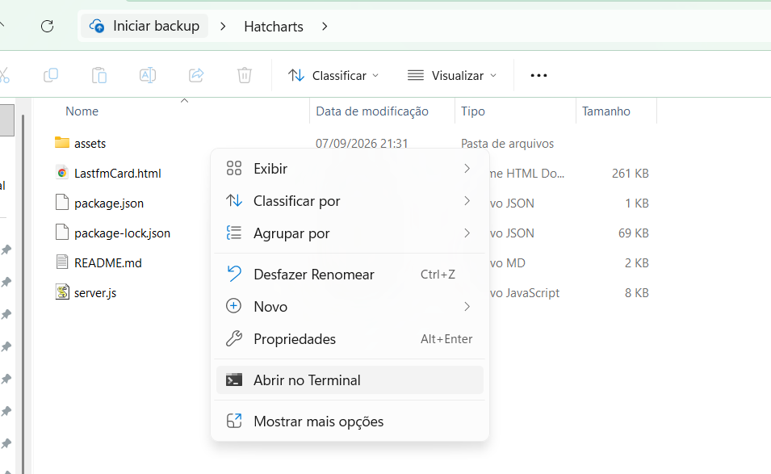
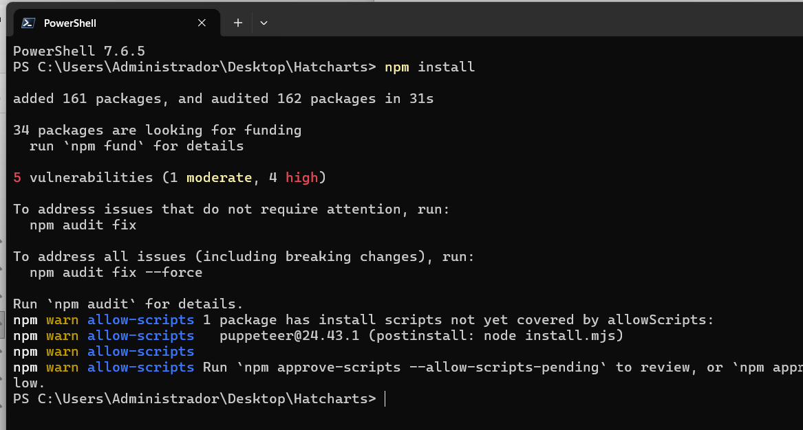
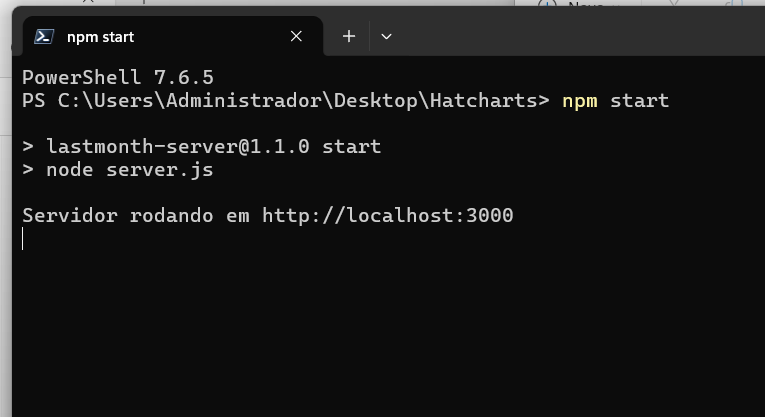
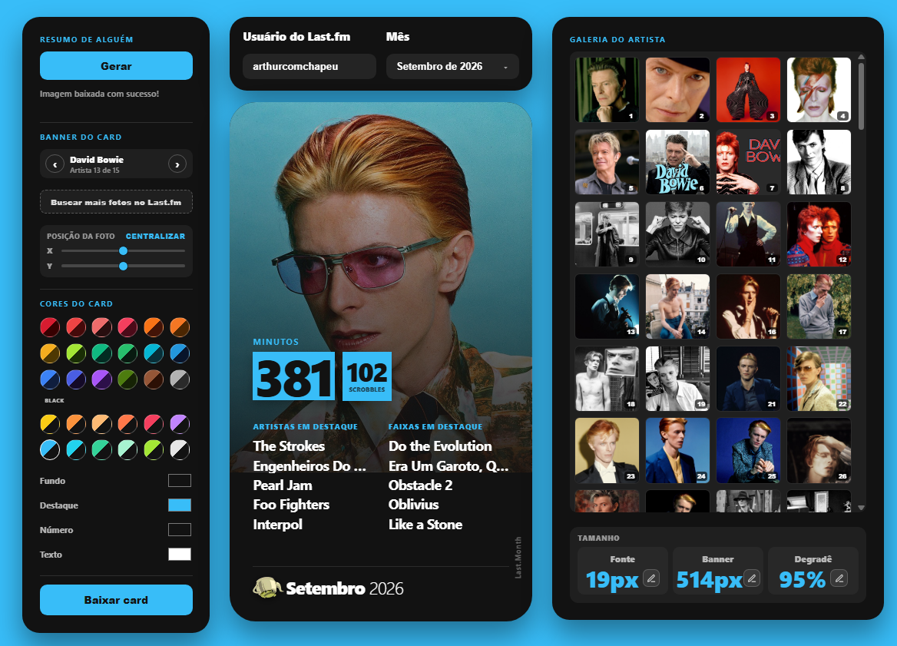

# Last.Month

Projeto de um card compartilhável para as redes sociais da sua atividade mensal do Last.fm

## Pré-requisitos

- [Node.js](https://nodejs.org/) (recomendado: versão 18 ou superior, LTS)
- npm (já vem junto com o Node.js)

## Instalando o Node.js

### Windows

1. Acesse [nodejs.org](https://nodejs.org/) e baixe o instalador **LTS**.
2. Execute o instalador baixado e siga os passos (Next, Next, Finish), mantendo as opções padrão.
3. Abra o **Prompt de Comando** (ou PowerShell) e confirme a instalação:
   ```
   node -v
   npm -v
   ```
   Se aparecerem os números das versões, deu certo.

## Instalando as dependências do projeto

Dentro da pasta do projeto (onde está o `package.json`), rode no terminal:

```
npm install
```






Isso vai instalar o `express` e o `puppeteer` (o Puppeteer baixa também uma versão do Chromium, então essa etapa pode demorar um pouco).

## Iniciando o servidor

```
npm start
```


O terminal vai mostrar:

```
Servidor rodando em http://localhost:3000
```

Basta abrir esse endereço no navegador.

## Configurando a API do Last.fm

Antes de gerar o card, você precisa de uma API Key do Last.fm (é gratuita):
Acesse last.fm/api/account/create e crie uma key.
Cole a key no campo e clique em aplicar
A key fica salva só no `localStorage` do seu navegador — não é enviada nem armazenada pelo servidor.



